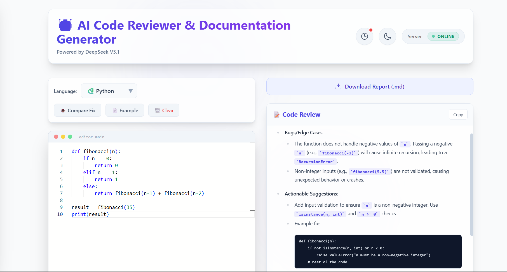

🤖 AI Code Reviewer & Documentation Generator

5th Semester Mini Project | Information Science & Engineering

A modern, intelligent web application that analyzes code snippets, detects bugs, suggests optimizations, and auto-generates professional documentation using the DeepSeek V3.1 AI model.

📸 Screenshots

Dark Mode Dashboard

Light Mode with Diff View

✨ Key Features

🧠 AI-Powered Analysis

Code Review: Detects logical errors, security vulnerabilities, and performance bottlenecks.

Auto-Documentation: Generates clean, standard docstrings (PEP 257, JSDoc, etc.).

Multi-Language Support: Python, JavaScript, Java, C++, Go, Rust, TypeScript, C#.

🎨 Modern User Interface

Glassmorphism Design: Sleek, semi-transparent UI elements with background blurs.

Dark/Light Mode: Fully responsive theme toggle with persistent preference saving.

Sticky Layout: The editor stays visible while you scroll through long analysis results.

🛠️ Advanced Tools

👁️ Diff View Comparison: Visualizes code fixes side-by-side (Red for deletions, Green for additions).

📜 History System: Auto-saves your last 10 analyses to Local Storage. Restore them anytime via the slide-out sidebar.

📥 Export Reports: Download your analysis and documentation as a Markdown (.md) file.

⌨️ Typewriter Effect: Real-time streaming animation for AI results, similar to ChatGPT.

🔔 Toast Notifications: Elegant popups for actions like copying code, errors, or successful downloads.

🏗️ Tech Stack

Frontend

Framework: React.js (Vite)

Styling: Tailwind CSS (via CDN for lightweight setup)

Editor: Monaco Editor (VS Code's core editor)

Markdown: react-markdown for rendering AI responses.

Backend

Framework: FastAPI (Python)

Server: Uvicorn

HTTP Client: HTTPX (Async requests)

AI Provider: OpenRouter API (DeepSeek-V3 Model)

🚀 Installation & Setup

Follow these steps to run the project locally.

Prerequisites

Node.js (v16+)

Python (v3.8+)

An API Key from OpenRouter

1. Backend Setup (Python)

Navigate to the backend folder (or root, depending on your structure):

# Create a virtual environment (Optional but recommended)
python -m venv venv
# Windows
venv\Scripts\activate
# Mac/Linux
source venv/bin/activate

# Install dependencies
pip install fastapi uvicorn httpx python-dotenv

Create a .env file in the same directory as main.py:

OPENROUTER_API_KEY=sk-or-v1-your-api-key-here...

Run the server:

python -m uvicorn main:app --reload --port 8000

The backend will run at http://localhost:8000

2. Frontend Setup (React)

Open a new terminal:

# Install dependencies
npm install @monaco-editor/react react-markdown

# Start the development server
npm run dev

The frontend will typically run at http://localhost:5173

📖 Usage Guide

Select Language: Choose your programming language from the dropdown.

Input Code: Paste your code into the editor or click "📄 Example" to load a sample.

Analyze: Click "✨ Run AI Analysis". The AI will stream the results.

Compare: If the AI suggests code changes, click "👁️ Compare Fix" to see a side-by-side diff.

History: Click the Clock Icon in the header to view or restore previous sessions.

Export: Click "Download Report" to save the findings.

📂 Project Structure

├── backend/
│   ├── main.py              # FastAPI Server & AI Logic
│   ├── .env                 # API Keys (GitIgnored)
│   └── requirements.txt     # Python dependencies
├── frontend/
│   ├── src/
│   │   ├── App.jsx          # Main Application Logic & UI
│   │   ├── App.css          # Custom Animations & Tailwind Overrides
│   │   ├── services/
│   │   │   └── api.js       # API connection logic
│   │   └── main.jsx         # React Entry point
│   └── index.html           # HTML entry (Tailwind CDN config)
└── README.md                # Documentation

🛡️ License

This project is developed for educational purposes.

Made with ❤️ by FURQAN NAIKWADI